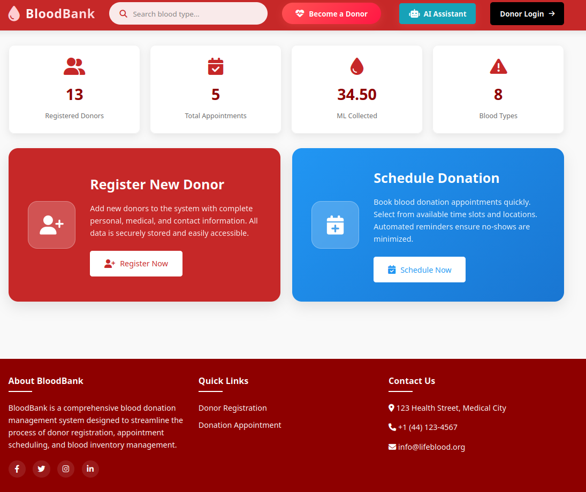
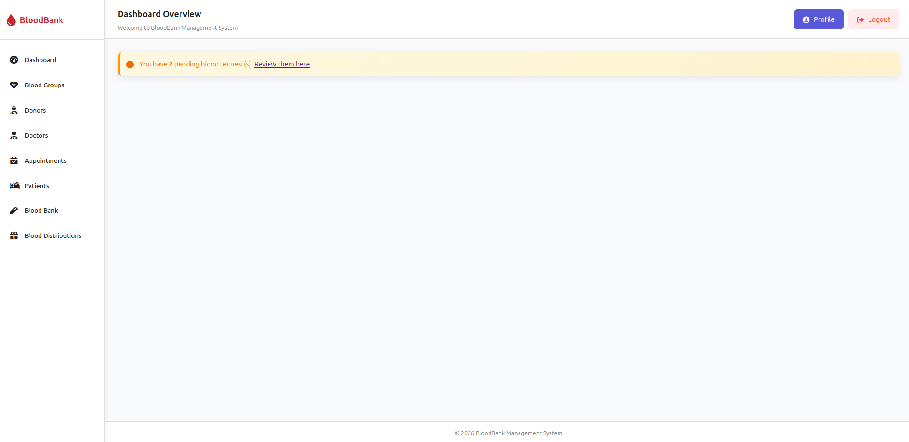
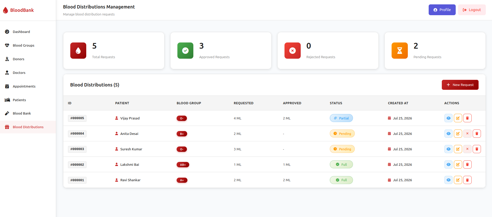
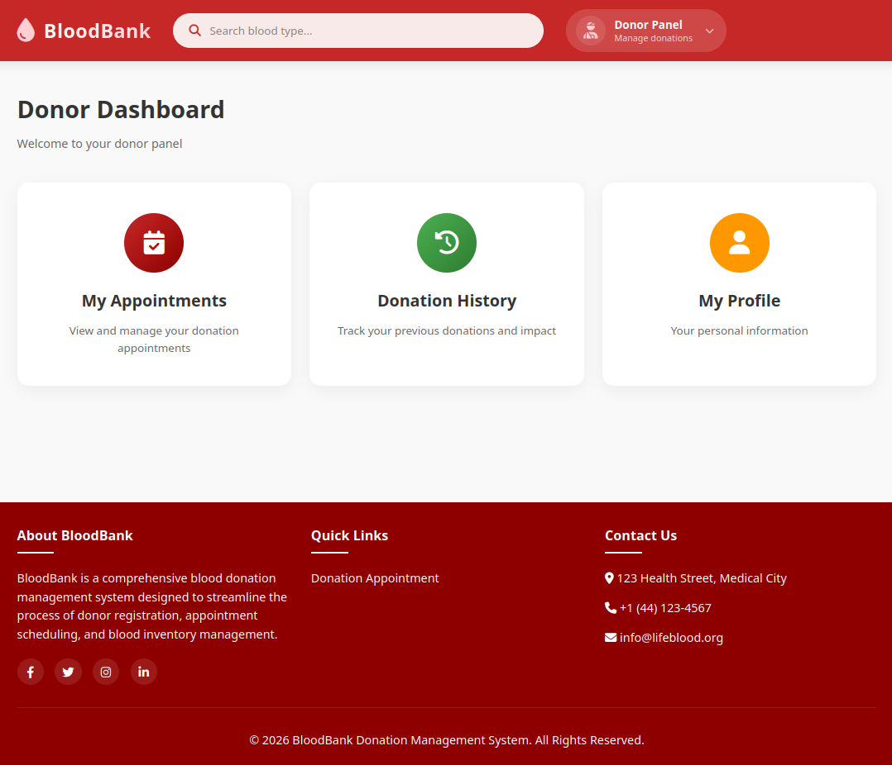
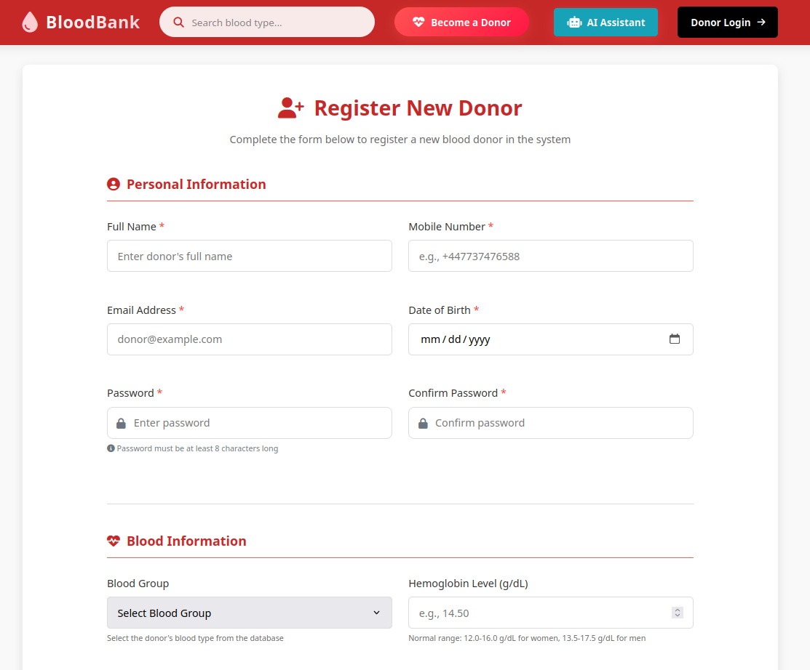
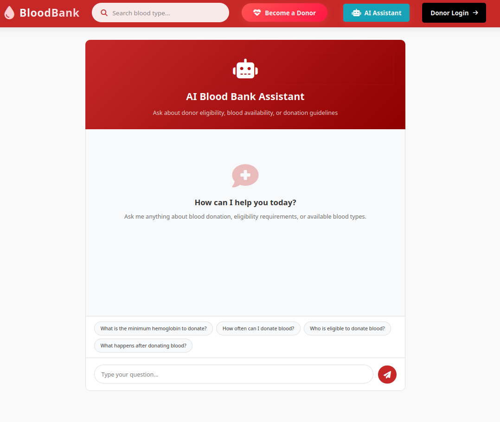

# Blood Bank Management System

A robust Blood Bank portal powered by **Laravel 13**, designed to simplify life-saving logistics. Features AI-powered assistance via **Ollama** for intelligent donor matching and eligibility screening.

**Live Project:** [https://obydullah.com/project/ai-blood-bank-management-system-ollama-llm-powered-healthcare-logistics-platform](https://obydullah.com/project/ai-blood-bank-management-system-ollama-llm-powered-healthcare-logistics-platform)

---

## Features

### Core Functionality

| Feature                    | Description                                                                                   |
| -------------------------- | --------------------------------------------------------------------------------------------- |
| **Donor Management**       | Complete CRUD with medical eligibility checks (hemoglobin, blood pressure, age, donation gap) |
| **Blood Inventory**        | Track blood units by group, donor, collection date, and expiry                                |
| **Appointment Scheduling** | Donor-doctor appointments with status workflow (Pending → Confirmed → Completed)              |
| **Blood Distribution**     | Request-approve-reject workflow with partial approval support                                 |
| **Patient Management**     | Patient records with medical history tracking                                                 |
| **Dual Authentication**    | Separate Admin (session-based) and Donor (Laravel Auth guard) portals                         |

### AI-Powered Features (Ollama)

| Feature                          | Description                                                 |
| -------------------------------- | ----------------------------------------------------------- |
| **Smart Eligibility Calculator** | LLM evaluates donor eligibility based on medical guidelines |
| **Automated Priority Engine**    | AI ranks blood distribution requests by urgency             |
| **Donor Matching**               | Find best-matched donors for critical requests              |
| **Support Chat**                 | Answer donor FAQs about eligibility and appointments        |

### System Architecture

- **Admin Portal** — Full CRUD for all entities, blood distribution approval, inventory management
- **Donor Portal** — Dashboard, appointment claiming, donation history, profile management
- **Public Website** — Blood search, blood request submission, donor self-registration

---

## Screenshots

### Website



### Admin Dashboard



### Blood Inventory



### Donor Dashboard



### Donor Registration



### AI Chat Assistant



---

## Tech Stack

| Layer            | Technology                      |
| ---------------- | ------------------------------- |
| Backend          | Laravel 13 (PHP 8.3+)           |
| Frontend         | Blade Templates, Tailwind CSS 4 |
| Build Tool       | Vite 7                          |
| Database         | MySQL 8.0 (Docker)              |
| AI/ML            | Ollama (local LLM)              |
| Containerization | Docker + Docker Compose         |

---

## Project Structure

```
Blood Bank/
├── blood-bank-docker/        # Docker configuration
│   ├── Dockerfile
│   ├── docker-compose.yml
│   ├── .env
│   └── config/ai.php
├── Source Code/              # Laravel 13 application
│   ├── app/
│   │   ├── Http/Controllers/ # 13 controllers
│   │   ├── Http/Middleware/   # Admin + Donor middleware
│   │   └── Models/           # 9 Eloquent models
│   ├── database/migrations/  # 11 migrations
│   ├── resources/views/      # 42 Blade templates
│   └── routes/web.php        # ~60 route definitions
└── New Folder/               # Legacy reference code
```

---

## Quick Start

### Prerequisites

- Docker & Docker Compose
- 4GB+ RAM (for Ollama)

### Installation

```bash
# 1. Navigate to Docker directory
cd blood-bank-docker

# 2. Start all containers
docker compose up -d

# 3. Install dependencies & run migrations
docker exec -it blood_bank_laravel composer install
docker exec -it blood_bank_laravel php artisan key:generate
docker exec -it blood_bank_laravel php artisan migrate --force

# 4. Pull Ollama model
docker exec blood_bank_ollama ollama pull llama3.2:3b

# 5. Seed demo data
docker exec -it blood_bank_laravel php artisan db:seed
```

### Access Points

| Service      | URL                               |
| ------------ | --------------------------------- |
| Laravel App  | http://localhost:8005             |
| Admin Portal | http://localhost:8005/admin-login |
| Donor Portal | http://localhost:8005/donor-login |
| phpMyAdmin   | http://localhost:8006             |
| Ollama API   | http://localhost:11434            |

### Default Credentials

| Role  | Username | Password |
| ----- | -------- | -------- |
| Admin | admin    | password |

---

## Database Schema

| Table                 | Purpose                                       |
| --------------------- | --------------------------------------------- |
| `admins`              | Admin authentication                          |
| `blood_groups`        | Blood type definitions (A+, A-, B+, B-, etc.) |
| `donors`              | Donor profiles with medical data              |
| `doctors`             | Doctor information                            |
| `patients`            | Patient records                               |
| `appointments`        | Donor-doctor scheduling                       |
| `blood_inventory`     | Blood stock tracking                          |
| `blood_distributions` | Blood request & approval workflow             |

---

## API Routes

### Public Routes

- `GET /` — Homepage
- `GET /search-blood` — Search blood availability
- `POST /blood-request` — Submit blood request
- `GET /donor-registration` — Donor registration form
- `POST /save-donor` — Register new donor

### Donor Routes (requires auth)

- `GET /donor-dashboard` — Donor dashboard
- `GET /donor-appointment` — View appointments
- `POST /appointment-store` — Claim an appointment
- `GET /donor-history` — Donation history
- `GET /donor-profile` — View profile

### Admin Routes (requires session)

- `GET /admin-dashboard` — Admin dashboard
- `GET /blood-groups/*` — Blood group CRUD
- `GET /donors/*` — Donor management
- `GET /doctors/*` — Doctor management
- `GET /appointments/*` — Appointment management
- `GET /patients/*` — Patient management
- `GET /blood-inventory/*` — Inventory management
- `GET /blood-distributions/*` — Distribution approval

---

## AI Integration (Ollama)

The system uses Ollama for local AI processing:

```php
use Laravel\Ai\Facades\Ai;

// Check donor eligibility
$response = Ai::ollama()->model('llama3.2:3b')
    ->prompt('Evaluate donor eligibility: hemoglobin 13.2g/dL, BP 120/80, age 25, last donation 4 months ago');

// Rank blood requests by urgency
$response = Ai::ollama()->model('llama3.2:3b')
    ->prompt('Rank these blood requests by urgency: ...');
```

---

## Development

```bash
# Access Laravel container
docker exec -it blood_bank_laravel bash

# Run artisan commands
docker exec -it blood_bank_laravel php artisan [command]

# Run tests
docker exec -it blood_bank_laravel php artisan test

# Clear cache
docker exec -it blood_bank_laravel php artisan config:clear
docker exec -it blood_bank_laravel php artisan cache:clear
```

---

## License

MIT License

---

## Contributing

1. Fork the repository
2. Create a feature branch
3. Commit your changes
4. Push to the branch
5. Open a Pull Request

---

## Support

For support, please open an issue in the GitHub repository.
